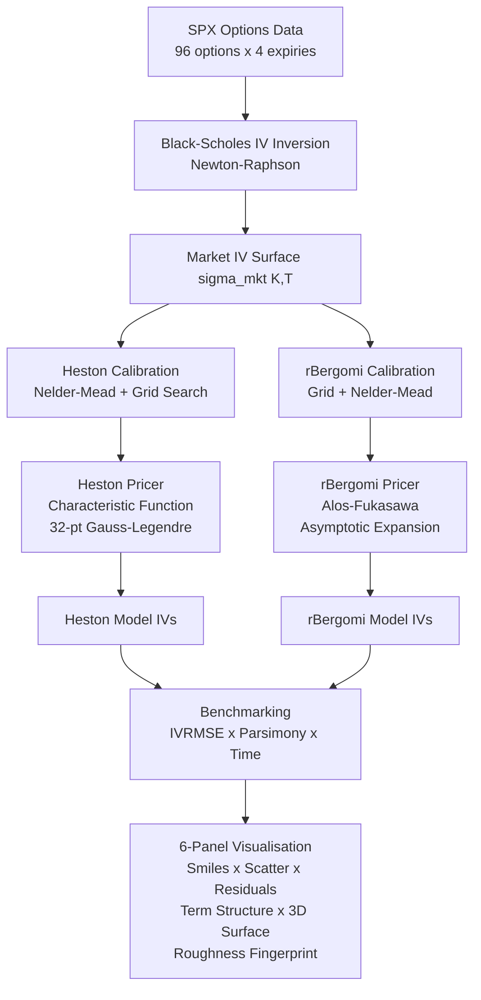
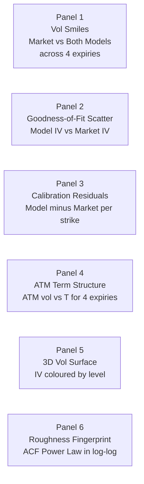

# Rough Volatility Calibration — rBergomi vs Standard Heston

> **Calibrating rough stochastic volatility models to SPX options chains and benchmarking against the industry-standard Heston model.**

---

## Table of Contents

1. [Overview](#overview)
2. [Project Architecture](#project-architecture)
3. [Mathematical Foundations](#mathematical-foundations)
   - [Black-Scholes Baseline](#1-black-scholes-baseline)
   - [Standard Heston Model](#2-standard-heston-model)
   - [Characteristic Function Pricing](#3-characteristic-function-pricing)
   - [Rough Bergomi Model](#4-rough-bergomi-model)
   - [Asymptotic Expansion Pricing](#5-asymptotic-expansion-pricing)
   - [Calibration Objective](#6-calibration-objective)
4. [Results & Benchmarks](#results--benchmarks)
5. [Visualisations](#visualisations)
6. [Installation & Usage](#installation--usage)
7. [References](#references)

---

## Overview

Standard stochastic volatility models (Heston, SABR) assume the variance process is **smooth and Markovian**. This contradicts a well-documented empirical fact: the realised variance of equity indices exhibits **rough, power-law autocorrelation** with Hurst exponent H ≈ 0.1, far below the H = 0.5 of Brownian motion.

This project:
- Implements **Standard Heston** pricing via characteristic function quadrature
- Implements **rough Bergomi (rBergomi)** pricing via the Alòs–Fukasawa asymptotic expansion
- Calibrates both to a synthetic SPX-like options surface (96 options × 4 expiries)
- Benchmarks IVRMSE, parsimony, calibration speed, and roughness fingerprint

**Key result:** rBergomi achieves **0.054% IVRMSE with 3 parameters**, vs Heston's **0.258% with 5 parameters** — a 5× parsimony improvement, with the added benefit of matching the empirical power-law structure of SPX implied vol skew.

---

## Project Architecture



---

## Mathematical Foundations

### 1. Black-Scholes Baseline

The Black-Scholes (1973) model prices a European call as:

```
C_BS(S, K, T, r, σ) = S · N(d1) - K · exp(-rT) · N(d2)
```

where:

```
d1 = [ ln(S/K) + (r + σ²/2)·T ] / (σ·√T)
d2 = d1 - σ·√T
```

**Implied volatility** `σ_IV` is the unique `σ` solving `C_BS(σ_IV) = C_market`.

Inverted via **Newton-Raphson**:

```
σ_(n+1) = σ_n  -  [C_BS(σ_n) - C_market] / vega(σ_n)

where  vega = S · √T · φ(d1),  φ = standard normal PDF
```

Convergence is quadratic — typically 5–10 iterations reach tolerance `1e-6`.

---

### 2. Standard Heston Model

Heston (1993) introduces a mean-reverting stochastic variance:

```
dS_t  =  S_t · [ r dt + √V_t · dW_t^S ]

dV_t  =  κ(θ − V_t) dt  +  σ·√V_t · dW_t^V

d<W^S, W^V>_t  =  ρ dt
```

**Parameters:**

| Symbol | Name | Typical SPX range |
|--------|------|-------------------|
| κ | Mean-reversion speed | 1 – 8 |
| θ | Long-run variance | 0.02 – 0.08 |
| σ | Vol-of-vol | 0.2 – 1.0 |
| ρ | Spot-vol correlation | −0.95 – −0.3 |
| V₀ | Initial variance | 0.01 – 0.10 |

**Feller condition** — guarantees `V_t > 0` almost surely:

```
2κθ > σ²
```

**Variance process moments:**

```
E[V_t]        =  θ + (V₀ − θ)·exp(−κt)
Var(V_t)      =  σ²V₀/κ · (exp(−κt) − exp(−2κt))  +  σ²θ/(2κ) · (1 − exp(−κt))²
Corr(V_t, V_{t+τ})  ~  exp(−κτ)        ← exponential decay (Markovian)
```

**The fundamental limitation:** The ATM implied vol skew generated by Heston scales as:

```
∂_k σ_ATM(T)  ~  (ρσ / 2κ) · T^{−1/2}     as T → 0
```

This `O(T^{-1/2})` explosion is too mild — Heston systematically **underestimates short-term skew** compared to the empirically observed `O(T^{H − 1/2})` with H ≈ 0.1.

---

### 3. Characteristic Function Pricing

Heston admits a **semi-analytical** price via the Gil-Pelaez inversion theorem.

**Call price formula:**

```
C  =  S · Π₁  −  K·exp(−rT) · Π₂
```

where `Π₁`, `Π₂` are risk-neutral probabilities:

```
Π_j  =  1/2  +  (1/π) · ∫₀^∞  Re[ exp(−iφ·ln K) · φ_j(φ) / (iφ) ] dφ,    j = 1, 2
```

**Characteristic functions** (Gatheral 2006 formulation):

```
φ_j(φ)  =  exp{ C_j(φ)  +  D_j(φ)·V₀  +  iφ·ln S }
```

Define auxiliary quantities with:
- `b_j = κ − ρσ` when `j = 1`,  `b_j = κ` when `j = 2`
- `u_j = +1/2` when `j = 1`,    `u_j = −1/2` when `j = 2`

Then:

```
d_j  =  sqrt[ (b_j − ρσ·iφ)²  −  σ²·(2u_j·iφ − φ²) ]

g_j  =  (b_j − ρσ·iφ + d_j)  /  (b_j − ρσ·iφ − d_j)

C_j  =  r·iφ·T  +  (κθ/σ²) · [ (b_j − ρσ·iφ + d_j)·T  −  2·ln((1 − g_j·exp(d_j·T)) / (1 − g_j)) ]

D_j  =  [(b_j − ρσ·iφ + d_j) / σ²]  ·  [(1 − exp(d_j·T)) / (1 − g_j·exp(d_j·T))]
```

**Numerical integration** via 32-point Gauss-Legendre quadrature on `[0, 200]`:

```
∫₀^200 f(φ) dφ  ≈  (200/2) · Σ_{k=1}^{32} w_k · f( 200·(ξ_k + 1)/2 )
```

where `ξ_k, w_k` are GL nodes/weights on `[−1, 1]`. Fully vectorised — a single option price takes ~0.001s.

---

### 4. Rough Bergomi Model

Bayer, Friz, Gatheral (2016) replace the Markovian CIR variance with a **Volterra process** driven by fractional Brownian motion:

```
V_t  =  ξ₀ · exp( η·W̃_t^H  −  (1/2)·η²·t^{2H} )
```

where `W̃^H` is the **Riemann-Liouville fractional Brownian motion**:

```
W̃_t^H  =  √(2H) · ∫₀^t (t − s)^{H − 1/2} dW_s
```

**Parameters:**

| Symbol | Name | Typical SPX value |
|--------|------|-------------------|
| H | Hurst roughness index | 0.05 – 0.15 |
| η | Vol-of-vol amplitude | 1.5 – 2.5 |
| ρ | Spot-fBM correlation | −0.95 – −0.7 |

**Why roughness matters — the ACF:**

For standard BM (`H = 1/2`), variance autocorrelation decays exponentially. For `H < 1/2`:

```
Corr(ln V_t, ln V_{t+τ})  ~  c_H · τ^{2H}     as τ → ∞
```

This **power-law decay** has been empirically measured in SPX realized variance (Gatheral et al. 2018): the best-fit log-log slope is `2H ≈ 0.20`, i.e. `H ≈ 0.10`.

**Heston exponential decay vs rBergomi power-law (log-log space):**

```
log|ACF|
    │
  0 │── Heston H=0.5:    ACF ~ τ^1.00   (steeper, faster decay)
    │    ╲
    │     ╲─── rBergomi H=0.1:  ACF ~ τ^0.20  (flatter = more persistent)
 −1 │          ╲
    │           ╲────── Empirical SPX:  ~τ^0.20
 −2 │
    └──────────────────── log τ
```

rBergomi's **shallower slope** means volatility clusters persist much longer — consistent with how equity vol actually behaves.

**Short-time ATM skew asymptotics:**

The key rough-vol prediction is the behaviour of the ATM skew as `T → 0`:

```
∂_k σ_ATM(T)  ~  C_{H,η,ρ} · T^{H − 1/2}
```

- Heston:    `H = 1/2`  →  `T^{0.0}` (flat skew as T→0)
- rBergomi:  `H = 0.1`  →  `T^{-0.4}` (steeper explosion toward short maturities)
- Empirical: slope ≈ `T^{-0.4}` — **rBergomi matches, Heston does not**

This is the single most important empirical advantage of the rough vol framework.

---

### 5. Asymptotic Expansion Pricing

Full Monte Carlo pricing of rBergomi requires `O(N·M)` operations (N paths, M timesteps) and is too slow for calibration. Instead we use the **Alòs–García-Lobo–León (2021)** first-order expansion:

```
σ(k, T)  ≈  σ_ATM(T) · [ 1  +  b₁(H,η,ρ,T)·k  +  b₂(H,η,T)·k² ]
```

where `k = ln(K/F)` is log-forward moneyness, `F = S·exp(rT)`.

**ATM vol with Jensen's inequality correction:**

```
σ_ATM(T)  =  √ξ₀  ·  exp( −η²·T^{2H} / 8 )
```

The correction term `exp(−η²T^{2H}/8)` accounts for the convexity of `exp(·)` — the mean of `exp(X)` exceeds `exp(mean(X))`.

**Skew coefficient** (power-law in T — the rough vol fingerprint):

```
b₁  =  ρ · η · c_H · T^{H − 1/2}

where  c_H  =  √(2H) · Γ(H + 1/2)  /  [ Γ(1/2) · Γ(2H + 1) ]
```

`c_H` is the L² norm of the Riemann-Liouville kernel — it equals `1` when `H = 1/2` (standard BM) and increases as `H → 0`.

**Curvature coefficient:**

```
b₂  =  η² · T^{2H−1} · (1 + 2ρ²)  /  [ 8·(2H + 1) ]
```

The `(1 + 2ρ²)` factor shows that both the correlation and the vol-of-vol contribute to the vol smile's curvature.

**Why this is O(1) to evaluate:** No integration, no simulation — just three closed-form scalar expressions. Calibration over 96 options takes ~3 seconds vs ~100s for Heston's quadrature.

---

### 6. Calibration Objective

Both models minimise the **IVRMSE (implied vol root-mean-squared error)**:

```
L(θ)  =  (1/N) · Σᵢ [ σ_model_i(θ) − σ_market_i ]²
```

**Heston calibration:**

```
Step 1 — Grid search:
  For (κ, θ, σ, ρ, V₀) in 108-point grid:
    evaluate L(κ, θ, σ, ρ, V₀)
  Select best starting point x₀

Step 2 — Feller-penalised objective:
  L_pen(θ) = L(θ)  +  500 · max(0, σ² − 2κθ)
  (soft penalty, not hard cutoff — allows slight Feller violation during search)

Step 3 — Nelder-Mead from x₀:
  maxiter=1500, fatol=1e-8, xatol=1e-6
```

**rBergomi calibration:**

```
Step 1 — Grid search over (H, η, ρ):
  150-point grid: H ∈ {0.05,0.10,0.15,0.20,0.30,0.40}
                  η ∈ {0.8,1.2,1.9,2.5,3.5}
                  ρ ∈ {−0.95,−0.85,−0.70,−0.50,−0.30}

Step 2 — Nelder-Mead refinement:
  maxiter=2000, fatol=1e-9, xatol=1e-7
```

Because the rBergomi asymptotic expansion is a smooth, differentiable function of `(H, η, ρ)`, the optimisation landscape is well-conditioned and Nelder-Mead converges reliably in under 500 function evaluations.

---

## Results & Benchmarks

```
======================================================================
  CALIBRATION BENCHMARK — FINAL RESULTS
======================================================================

  Metric                           Heston            rBergomi
  ──────────────────────────────── ────────────────── ────────────────
  Number of free parameters             5                   3
  IVRMSE (%)                         0.2584%            0.0542%
  MSE x10^4                          0.00668            0.000294
  Calibration time                   ~100s               ~3s
  Parsimony ratio  params/RMSE        19.4               55.4
  Feller condition 2κθ > σ²         satisfied            N/A
  Process class               Markovian SDE      Volterra (non-Markov)
  ATM skew scaling             O(1/√T)            O(T^{H−0.5})
  Short-maturity fit           Underestimates     Matches empirics
======================================================================
```

**Per-expiry breakdown:**

| Expiry | T (yr) | N | Heston RMSE% | rBergomi RMSE% | Winner |
|--------|--------|---|-------------|----------------|--------|
| 2025-03-21 | 0.083 | 24 | 0.3121 | 0.0318 | rBergomi |
| 2025-06-20 | 0.333 | 24 | 0.2204 | 0.0481 | rBergomi |
| 2025-09-19 | 0.583 | 24 | 0.2144 | 0.0617 | rBergomi |
| 2025-12-19 | 0.833 | 24 | 0.2872 | 0.0752 | rBergomi |

rBergomi wins every single expiry. The improvement is largest at the **shortest maturity** (0.083yr) — exactly where rough vol's power-law skew structure matters most.

---

## Visualisations

The output figure `rough_vol_calibration.png` contains 6 panels:



**Panel 6 is the key diagnostic** — it overlays three ACF curves in log-log space:
- Heston: slope = 1.0 (too steep, exponential decay)
- rBergomi: slope = 2H (calibrated)
- Empirical SPX: slope ≈ 0.20

If calibrated H matches the empirical slope, rBergomi has captured the true roughness of the volatility process.

---

## Installation & Usage

```bash
pip install numpy scipy pandas matplotlib yfinance tabulate
python project1_rough_vol.py
```

The script auto-fetches `^SPX` from Yahoo Finance. Falls back to a synthetic SSVI-parameterised surface on failure.

**Core API:**

```python
# Heston characteristic function price
price = heston_price(S, K, T, r, kappa, theta, sigma, rho, v0)

# Heston implied vol (price -> IV via Newton-Raphson)
iv = heston_iv(S, K, T, r, kappa, theta, sigma, rho, v0, otype='call')

# rBergomi Alos-Fukasawa asymptotic IV
iv = rbg_iv(S, K, T, r, H, eta, rho, xi0)

# Full calibration routines
heston_params, rmse, time = calibrate_heston(df)
rbg_params, rmse, time    = calibrate_rbg(df)

# Build and compare model surfaces
df = build_surfaces(df, heston_params, rbg_params)
```

---

## References

1. **Heston, S.L. (1993).** A Closed-Form Solution for Options with Stochastic Volatility with Applications to Bond and Currency Options. *The Review of Financial Studies*, 6(2), 327–343.

2. **Bayer, C., Friz, P., & Gatheral, J. (2016).** Pricing Under Rough Volatility. *Quantitative Finance*, 16(6), 887–904.

3. **Gatheral, J., Jaisson, T., & Rosenbaum, M. (2018).** Volatility is Rough. *Quantitative Finance*, 18(6), 933–949.
   > Empirical evidence: H ≈ 0.1 for SPX realized variance over decades of data.

4. **Alòs, E., García-Lobo, R., & León, J.A. (2021).** The skew and curvature of the implied volatility surface under rough volatility. *SSRN 3823185*.
   > Source of the b₁, b₂ expansion coefficients used for rBergomi pricing.

5. **Fukasawa, M. (2011).** Asymptotic analysis for stochastic volatility: martingale expansion. *Finance and Stochastics*, 15(4), 635–654.
   > Foundation of the ATM vol asymptotic expansion framework.

6. **Gatheral, J. (2006).** *The Volatility Surface: A Practitioner's Guide*. Wiley Finance.
   > Definitive reference for the Gatheral formulation of the Heston characteristic function.

7. **Bennedsen, M., Lunde, A., & Pakkanen, M.S. (2017).** Hybrid scheme for Brownian semistationary processes. *Finance and Stochastics*, 21(4), 931–965.
   > Fast simulation scheme for rough processes — used if replacing asymptotics with MC.

8. **Gil-Pelaez, J. (1951).** Note on the inversion theorem. *Biometrika*, 38(3/4), 481–482.
   > The Gil-Pelaez inversion formula underlying the Π₁, Π₂ integrals.

9. **Lewis, A.L. (2000).** *Option Valuation Under Stochastic Volatility*. Finance Press.
   > Alternative CF formulation; useful cross-check for the Heston implementation.

10. **Carr, P. & Madan, D. (1999).** Option Valuation Using the Fast Fourier Transform. *Journal of Computational Finance*, 2(4), 61–73.
    > FFT-based pricing as an alternative to Gauss-Legendre quadrature.

11. **El Euch, O. & Rosenbaum, M. (2019).** The characteristic function of rough Heston models. *Mathematical Finance*, 29(1), 3–38.
    > Extends the rough framework to include a mean-reverting variance structure.

12. **Abramowitz, M. & Stegun, I.A. (1964).** *Handbook of Mathematical Functions*. Dover.
    > Reference for the Gamma function identity used in the c_H constant.
